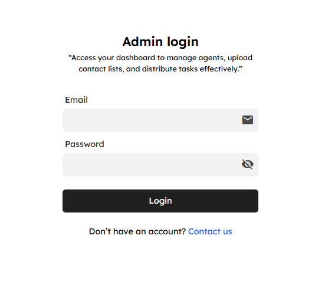
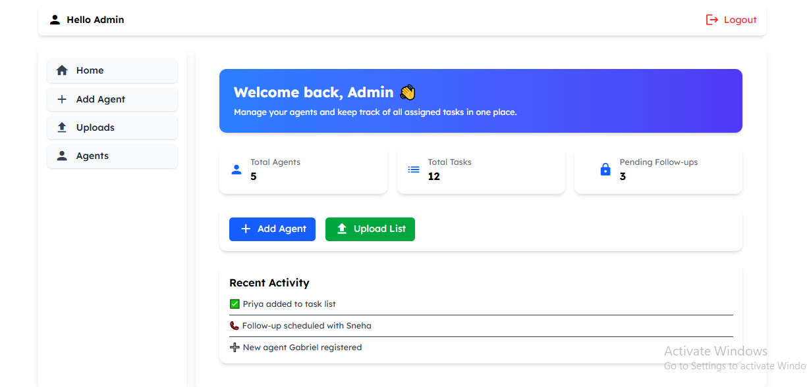

🚀 Agent Management System

A full-stack Agent Management System built with Next.js (Client) and Node.js + Express + MongoDB (Server).
This project follows Atomic Design principles for frontend component architecture and implements JWT-based authentication for secure access.

✨ Features

🔐 Admin Login with JWT authentication

🏗 Atomic Design Approach (Atoms → Molecules → Organisms → Layouts)

📂 Task Management (Add, Upload & Assign tasks to Agents)

👨‍💼 Agent Module – View, Manage, and Update Agents

📤 File Uploads (CSV, XLSX) for bulk task imports

🛡 Protected Routes with Token Verification (Client + Server)

📑 Scalable Backend – Models, Controllers, Middleware separation

🛠 Tech Stack

Frontend (Client)

⚛ Next.js 14

🎨 TailwindCSS

📦 Atomic Design Pattern

Backend (Server)

🟢 Node.js + Express.js

🗄 MongoDB with Mongoose

🔑 JWT Authentication

📂 Multer (for file uploads)

📂 Project Structure
Client (Next.js)
app/
 ├── atoms/         # Smallest reusable components (Button, Input, Icon, etc.)
 ├── molecules/     # Combinations of atoms (InputWithIcon, etc.)
 ├── organisms/     # Complex components (Forms, Menus, etc.)
 ├── dashboard/     # Dashboard Layout containing main pages
 │    ├── agents/   # Agents list page
 │    ├── agent/    # Single agent details
 │    ├── uploads/  # Upload CSV/XLSX files
 │    ├── login/    # Login page
 ├── types/         # Type definitions
 ├── utils/         # Token verification & helpers

Server (Node.js + Express)
server/
 ├── models/        # MongoDB Models
 ├── controllers/   # Request handling logic
 ├── routes/        # Route definitions
 ├── schemas/       # Schema validation
 ├── middleware/    # Parsing + Token verification
 ├── app.js         # Entry point where everything is wrapped

🔑 Admin Credentials
Email:    admin@example.com  
Password: strongPass123

⚙️ Setup Instructions
1️⃣ Clone Repository
git clone https://github.com/your-username/agent-management.git
cd agent-management

Create a .env file in server/ root:

PORT=5000
MONGO_URI=your_mongodb_connection_string
JWT_SECRET=your_secret_key

npm install

Create a .env.local file in client/ root:

NEXT_PUBLIC_API_URL=http://localhost:5000

Run client:

npm run dev

📸 Screenshots

| Method | Endpoint     | Description               |
| ------ | ------------ | ------------------------- |
| POST   | `/login`     | Admin login               |
| GET    | `/agentlist` | Fetch all agents          |
| GET    | `/agent/:id` | Fetch single agent        |
| POST   | `/uploads`   | Upload CSV/XLSX task list |
